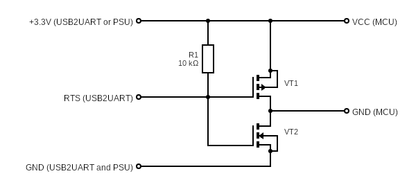

### hc32l110-serial-boot

This is a console utility that allows you to read, write and erase the flash memory of the HC32L110 microcontroller using a USB2UART adapter (tested on CP2102).

If it is possible to use the unlocked RST pin (P00) of the microcontroller, use the following connection list:
```
USB2UART.RX   -> MCU.P31
USB2UART.TX   -> MCU.P27
USB2UART.3.3V -> MCU.VCC
USB2UART.GND  -> MCU.GND
USB2UART.RTS  -> MCU.P00
```

If the unlocked RST pin (P00) is not available, you have to use the following power supply connection to the MCU:
```
USB2UART.RX   -> MCU.P31
USB2UART.TX   -> MCU.P27
USB2UART.3.3V -> see circuit diagram below
USB2UART.GND  -> see circuit diagram below
USB2UART.RTS  -> see circuit diagram below
```

VT1 is a p-channel MOSFET, such as AO3401.
VT2 is a n-channel MOSFET, such as AO3402.


#### Usage (Linux)
```
$ ./hc32l110-serial-boot
The -p option is required.

Usage:
  hc32l10-serial-boot -p <serport> [-b] [-l <length>] [-f <file>]

Mandatory arguments for input:
  -p <serport>       serial port name
Command arguments for input:
  -b                 simply switches HC32L110 into serial bootloader mode, then you can use the original HDSC ISP
  -r <file>          read flash memory to file
  -w <file>          write flash memory from file
  -e                 erase flash memory
Command-specific input arguments:
  -a <address>       data address in hexadecimal notation
  -s <size>          data size in hexadecimal notation

Examples:
  hc32l10-serial-boot -p/dev/ttyUSB0 -b
  hc32l10-serial-boot -p/dev/ttyUSB0 -rflash.bin
  hc32l10-serial-boot -p/dev/ttyUSB0 -rflash.bin -a0x1000 -s0x100
  hc32l10-serial-boot -p/dev/ttyUSB0 -wflash.bin
  hc32l10-serial-boot -p/dev/ttyUSB0 -wflash.bin -a0x1000
  hc32l10-serial-boot -p/dev/ttyUSB0 -e
  hc32l10-serial-boot -p/dev/ttyUSB0 -e -a0x1000
```

#### Usage (Windows)
See [Usage (Linux)](#usage-linux)
